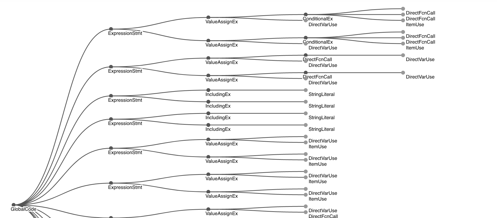
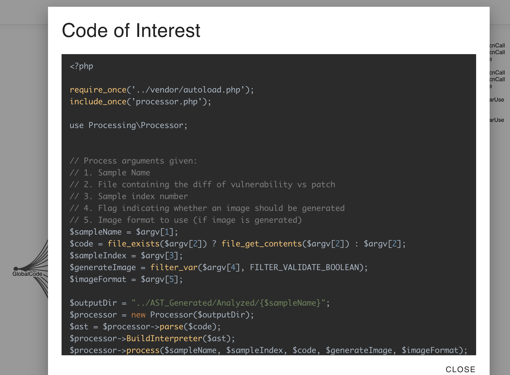

# AST.Visualizer

## Description

UI & API utilizing the [AST.Parsers](https://github.com/lukeholt2/ast.parser) library to visualize Abstract Syntax Trees of various languages.

## Visuals

Abstract Syntax Trees can be viewed by directly uploaded source code files. The source will be parsed to build a tree structure containing the node type and original source code.

The original source code can also be viewed directly from the parsed tree. Selecting an indivual node will open a dialog showing a formatted version of the original source code.

## Development

### Frontend

The frontend consists of a `React` client. To install the client dependencies inside the `ClientApp` directory run:

`npm i` 

This will install all client side libraries used, including [`D3.js`](https://d3js.org/) which is used to create the tree visuals.

### Backend

The backend API is written in `C#` using `ASP.NET Core`. Running the server requires the .NET 6.0+ SDK. 
